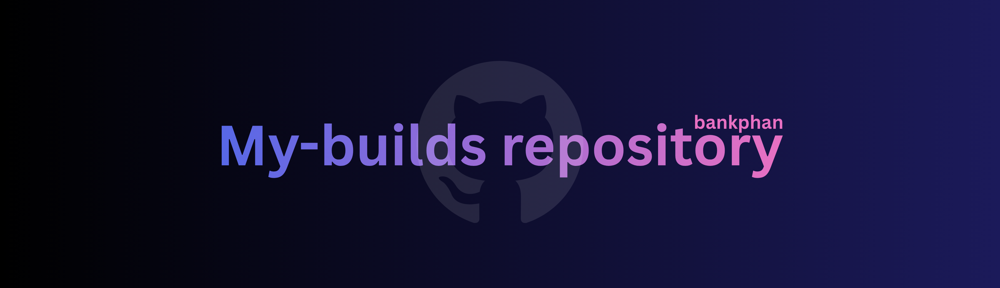

  

This repository organizes and links to all my builds, where I transform concepts into concrete solutions.

---

## 📁 Website Developmenet project

- [Amazon clone website](https://amazon-clone-website-nu.vercel.app/) | [Amazon Clone Website repository](https://github.com/bankphan/amazon-clone-website) - November 2025